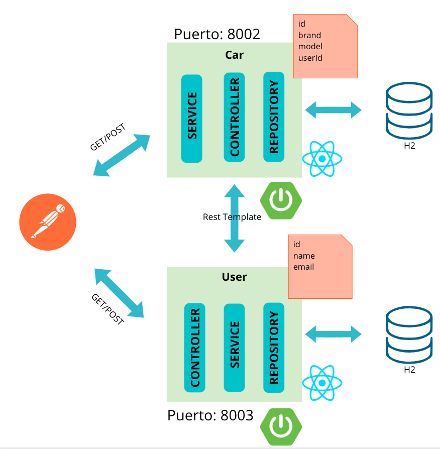

# Microservicios:   **+**  

## Instalación (Windows, Linux, MacOS)
https://nodejs.org/en/download/

## App en React
1. Crear app: `npx create-react-app nombre-app`
2. Correr app: `npm start`
3. Abrir app: http://localhost:3000

## Documentación 
- React: https://es.reactjs.org/docs/getting-started.html
- Axios: https://axios-http.com/docs/intro
- Imagen Node: https://hub.docker.com/_/node

## Arquitectura Orientada a Microservicios con Java Spring Boot

<table><tr><td>

</td></tr></table>
